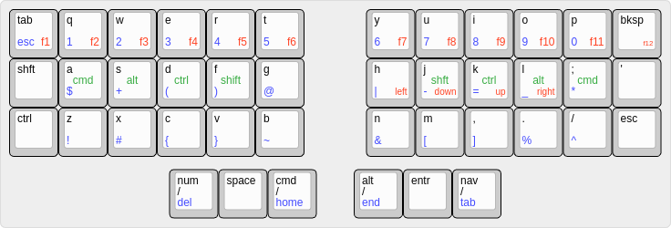

# KB Layout

[layout perma link](http://www.keyboard-layout-editor.com/##@@_t=%23000000%0A%230039ff%0A%0A%23ff0000%0A%0A%0A%0A%0A%0A%23008f26%3B&=tab%0Aesc%0A%0Af1&=q%0A1%0A%0Af2&=w%0A2%0A%0Af3&=e%0A3%0A%0Af4&=r%0A4%0A%0Af5&=t%0A5%0A%0Af6&_x:1.25%3B&=y%0A6%0A%0Af7&=u%0A7%0A%0Af8&=i%0A8%0A%0Af9&=o%0A9%0A%0Af10&=p%0A0%0A%0Af11&_fa@:0&:0&:0&:1%3B%3B&=bksp%0A%0A%0Af12%3B&@=shft&=a%0A$%0A%0A%0A%0A%0A%0A%0A%0Acmd&=s%0A+%0A%0A%0A%0A%0A%0A%0A%0Aalt&=d%0A(%0A%0A%0A%0A%0A%0A%0A%0Actrl&=f%0A)%0A%0A%0A%0A%0A%0A%0A%0Ashift&=g%0A%2F@&_x:1.25&fa@:0&:0&:0&:2%3B%3B&=h%0A%7C%0A%0Aleft&=j%0A-%0A%0Adown%0A%0A%0A%0A%0A%0Ashft&=k%0A%2F=%0A%0Aup%0A%0A%0A%0A%0A%0Actrl&=l%0A%2F_%0A%0Aright%0A%0A%0A%0A%0A%0Aalt&=%2F%3B%0A*%0A%0A%0A%0A%0A%0A%0A%0Acmd&='%3B&@=ctrl&=z%0A!&=x%0A%23&=c%0A%7B&=v%0A%7D&=b%0A~&_x:1.25%3B&=n%0A%2F&&=m%0A%5B&=,%0A%5D&=.%0A%25&=%2F%2F%0A%5E&=esc%3B&@_y:0.25&x:3.25%3B&=num%0Adel%0A%0A%0A%0A%0A%2F%2F&=space&=cmd%0Ahome%0A%0A%0A%0A%0A%2F%2F&_x:0.75%3B&=alt%0Aend%0A%0A%0A%0A%0A%2F%2F&=entr&=nav%0Atab%0A%0A%0A%0A%0A%2F%2Fd)

